<div align="center">

# 🔥 Vinh Phoenix - Phượng Hoàng Trung Đô

## *Reusable Agent Skills for Structured Software Development*

**A curated library of 18 production-ready skills that power AI coding assistants to deliver quality software through structured workflows.**

[](https://github.com/dauquangthanh/vinh-phoenix/actions/workflows/release.yml)
[](https://github.com/dauquangthanh/vinh-phoenix/stargazers)
[](https://github.com/dauquangthanh/vinh-phoenix/blob/main/LICENSE)
[](https://dauquangthanh.github.io/vinh-phoenix/)

</div>

---

## Table of Contents

- [🎯 What is Vinh Phoenix?](#-what-is-vinh-phoenix)
- [🧩 The Skills Library](#-the-skills-library)
- [⚡ Quick Start](#-quick-start)
- [🤖 Supported AI Agents](#-supported-ai-agents)
- [🔧 Phoenix CLI Reference](#-phoenix-cli-reference)
- [🌟 Development Workflows](#-development-workflows)
- [🏗️ Project Structure](#-project-structure)
- [📋 Detailed Walkthrough](#-detailed-walkthrough)
- [🔍 Troubleshooting](#-troubleshooting)
- [💬 Support](#-support)
- [🙏 Credits](#-credits)
- [📄 License](#-license)

## 🎯 What is Vinh Phoenix?

**Vinh Phoenix is a skills library that transforms AI coding assistants into structured development partners.**

Instead of ad-hoc prompting, Phoenix provides 18 battle-tested skills that guide AI assistants through:

- ✅ Requirements specification and clarification
- ✅ Architecture design and review
- ✅ Technical planning and implementation
- ✅ Code quality and consistency analysis
- ✅ Test design and execution
- ✅ Project management and tracking

**The Phoenix CLI** installs these skills into your project, making them instantly available to 20+ AI coding assistants. Skills are automatically discovered and used by AI models when your tasks match their descriptions.

> **Think of it like a professional toolkit:** Just as a craftsperson has specialized tools for each task, Phoenix gives your AI assistant specialized skills for each phase of software development. The AI automatically activates relevant skills based on what you're trying to accomplish.

## 🧩 The Skills Library

Phoenix includes **18 modular skills**, each containing:

- 📋 **Templates** - Structured formats for specifications, plans, and documentation
- 🔧 **Scripts** - Automation for git operations, file management, and workflows (bash & PowerShell)
- 📖 **Documentation** - Clear guidance on when and how to use each skill

### Available Skills

| Category | Skills | Purpose |
|----------|--------|----------|
| **Requirements** | `requirements-specification`<br/>`requirements-specification-review` | Define and validate what to build |
| **Architecture** | `architecture-design`<br/>`architecture-design-review`<br/>`context-assessment` | Design systems and understand existing codebases |
| **Planning** | `technical-design`<br/>`technical-design-review`<br/>`project-management` | Create implementation plans and track progress |
| **Standards** | `coding-standards`<br/>`project-ground-rules-setup`<br/>`project-consistency-analysis` | Establish and maintain quality standards |
| **Implementation** | `coding`<br/>`code-review` | Write and review code |
| **Testing** | `e2e-test-design` | Design comprehensive test suites |
| **Integration** | `tasks-to-github-issues`<br/>`tasks-to-azure-devops` | Sync with project management tools |
| **Version Control** | `git-commit` | Manage commits with semantic messages |
| **Prototyping** | `nextjs-mockup`<br/>`nuxtjs-mockup` | Generate framework-specific mockups |

**Key Benefits:**

- 🔄 **Reusable** - Each skill works across projects and frameworks
- 🤝 **Multi-agent** - Same skills power 20+ AI assistants
- 🎯 **Focused** - Each skill handles one aspect of development
- 📦 **Self-contained** - Templates and scripts embedded in each skill
- 🔧 **Cross-platform** - Both bash and PowerShell scripts included

## ⚡ Quick Start

### 1. Install Phoenix CLI

```bash
# Install once, use everywhere
uv tool install phoenix-cli --from git+https://github.com/dauquangthanh/vinh-phoenix.git
```

**Upgrade to latest version:**

```bash
uv tool install phoenix-cli --force --from git+https://github.com/dauquangthanh/vinh-phoenix.git
```

<details>
<summary><strong>Alternative: Run without installing</strong></summary>

```bash
uvx --from git+https://github.com/dauquangthanh/vinh-phoenix.git phoenix init <PROJECT_NAME>
```

</details>

### 2. Initialize Your Project

```bash
phoenix init <PROJECT_NAME>
phoenix check
```

This installs all 18 skills into agent-specific folders (`.github/skills/`, `.claude/skills/`, etc.), making them discoverable by your AI assistant.

<p align="center">
  
</p>

### 3. Start Building

Launch your AI assistant and describe what you want to build:

```text
"Create project ground rules focused on code quality and testing standards"
"Specify a photo organizer with drag-and-drop albums"
"Design this using Next.js with TypeScript and Tailwind CSS"
"Break this down into actionable tasks"
"Implement all the tasks"
```

Skills are loaded automatically when your task matches their purpose.

---

## 🤖 Supported AI Agents

| Agent                                                     | Support | Notes                                             |
| ----------------------------------------------------------- | --------- |---------------------------------------------------|
| [Amazon Q Developer CLI](https://aws.amazon.com/developer/learning/q-developer-cli/) | ⚠️ | File-based prompts [do not support argument substitution](https://github.com/aws/amazon-q-developer-cli/issues/3064) despite CLI accepting arguments. |
| [Amp](https://ampcode.com/)                               | ✅ | Available as CLI/TUI and editor extension. Model-agnostic with role-specific modes. |
| [Auggie CLI](https://docs.augmentcode.com/cli/overview)   | ✅ | Command-line interface for agentic code assistance. |
| [Claude Code](https://www.anthropic.com/claude-code)      | ✅ | Desktop application powered by Claude AI models. |
| [CodeBuddy CLI](https://www.codebuddy.ai/cli)             | ✅ | Command-line AI coding assistant. |
| [Codex CLI](https://github.com/openai/codex)              | ✅ | Terminal-based coding assistant. |
| [Cursor](https://cursor.sh/)                              | ✅ | AI-first code editor based on VS Code. |
| [Gemini CLI](https://github.com/google-gemini/gemini-cli) | ✅ | Open-source terminal AI agent with 1M token context window. Supports MCP servers. |
| [GitHub Copilot](https://code.visualstudio.com/)          | ✅ | IDE extension powered by OpenAI models. |
| [Google Antigravity](https://ai.google.dev/)              | ✅ | IDE-based agent with slash command support. |
| [IBM Bob](https://www.ibm.com/products/bob)               | ✅ | IDE-based agent with code review, vulnerability detection, and modernization support. |
| [Jules](https://jules.google.com/)                        | ✅ | Autonomous coding agent that works in isolated VMs. Includes built-in peer review. |
| [Kilo Code](https://github.com/Kilo-Org/kilocode)         | ✅ | Community-driven AI coding assistant. |
| [opencode](https://opencode.ai/)                          | ✅ | Open-source AI coding platform. |
| [Qoder CLI](https://qoder.ai)                             | ✅ | Terminal-based AI development assistant. |
| [Qwen Code](https://github.com/QwenLM/qwen-code)          | ✅ | Qwen-powered coding assistant. |
| [Roo Code](https://roocode.com/)                          | ✅ | Open-source VS Code extension with cloud agent team support. Model-agnostic with role-specific modes. |
| [SHAI (OVHcloud)](https://github.com/ovh/shai)            | ✅ | Rust-based terminal agent with HTTP server mode. Supports MCP servers and multiple LLM providers. |
| [Windsurf](https://windsurf.com/)                         | ✅ | IDE with Cascade agent for autonomous coding. 1M+ users. Supports MCP servers and memories. |

## 🔧 Phoenix CLI Reference

The `phoenix` command supports the following options:

### Commands

| Command     | Description                                                    |
| ------------- | ---------------------------------------------------------------- |
| `init`      | Initialize a new Phoenix project from the latest template      |
| `check`     | Check for installed tools (`git`, `claude`, `gemini`, `code`/`code-insiders`, `cursor-agent`, `windsurf`, `qwen`, `opencode`, `codex`, `kilocode`, `auggie`, `roo`, `codebuddy`, `amp`, `shai`, `q`, `bob`, `jules`, `qoder`, `antigravity`) |
| `version`   | Display CLI version, template version, and system information  |

### `phoenix init` Arguments & Options

| Argument/Option        | Type     | Description                                                                  |
| ------------------------ | ---------- |------------------------------------------------------------------------------|
| `<project-name>`       | Argument | Name for your new project directory (optional if using `--here`, or use `.` for current directory) |
| `--ai`                 | Option   | AI assistant(s) to use. Can be a single agent or comma-separated list (e.g., `claude,gemini,copilot`). Valid options: `claude`, `gemini`, `copilot`, `cursor-agent`, `qwen`, `opencode`, `codex`, `windsurf`, `kilocode`, `auggie`, `roo`, `codebuddy`, `amp`, `shai`, `q`, `bob`, `jules`, `qoder`, `antigravity`. If not specified, an interactive multi-select menu will appear |
| `--ignore-agent-tools` | Flag     | Skip checks for AI agent tools like Claude Code                             |
| `--no-git`             | Flag     | Skip git repository initialization                                          |
| `--here`               | Flag     | Initialize project in the current directory instead of creating a new one   |
| `--force`              | Flag     | Force merge/overwrite when initializing in current directory (skip confirmation) |
| `--skip-tls`           | Flag     | Skip SSL/TLS verification (not recommended)                                 |
| `--debug`              | Flag     | Enable detailed debug output for troubleshooting                            |
| `--github-token`       | Option   | GitHub token for API requests (or set GH_TOKEN/GITHUB_TOKEN env variable)  |

### Examples

```bash
# Basic project initialization
phoenix init my-project

# Initialize with specific AI assistant
phoenix init my-project --ai claude

# Initialize with multiple AI assistants (comma-separated)
phoenix init my-project --ai claude,gemini,copilot

# Initialize with Cursor support
phoenix init my-project --ai cursor-agent

# Initialize with multiple agents including Windsurf and Amp
phoenix init my-project --ai windsurf,amp,claude

# Initialize with SHAI support
phoenix init my-project --ai shai

# Initialize with IBM Bob support
phoenix init my-project --ai bob

# Initialize in current directory
phoenix init . --ai copilot
# or use the --here flag
phoenix init --here --ai copilot

# Force merge into current (non-empty) directory without confirmation
phoenix init . --force --ai copilot
# or
phoenix init --here --force --ai copilot

# Skip git initialization
phoenix init my-project --ai gemini --no-git

# Enable debug output for troubleshooting
phoenix init my-project --ai claude --debug

# Use GitHub token for API requests (helpful for corporate environments)
phoenix init my-project --ai claude --github-token ghp_your_token_here

# Check system requirements
phoenix check

# Display version and system information
phoenix version
```

### Available Agent Skills

After running `phoenix init`, **18 agent skills** will be discoverable by your AI assistant.

#### How It Works: Skills-Based Architecture

**Phoenix uses the Agent Skills format** - an open standard for giving AI agents new capabilities:

- **Automatic Discovery** - At startup, agents load the name and description of each skill
- **On-Demand Activation** - When your task matches a skill's description, the AI loads full instructions
- **Progressive Disclosure** - Skills stay fast by loading context only when needed

**What gets installed:**

- 18 reusable skill modules (in `skills/`), each with its own templates and scripts
- Skills like `requirements-specification`, `technical-design`, `coding`, etc.
- Both bash and PowerShell scripts included automatically

**How agents use skills:**

1. You describe what you want to build
2. The AI identifies relevant skills based on descriptions
3. The AI loads skill instructions and follows them
4. Scripts and templates are used as needed

This modular design enables:

- **Multi-agent support** - 20+ AI assistants use the same skills format
- **Easy updates** - Upgrade all skills at once with `phoenix init --here --force`

After running `phoenix init`, your AI assistant can leverage these skills:

> **💡 Automatic Commits:** All commands automatically generate semantic commit messages and commit their changes upon completion, maintaining a clear project history without manual intervention.

| Skill | When the AI Uses It | Auto Commit Prefix |
| ----- | ------------------- | ------------------ |
| `project-ground-rules-setup` | When you ask to create or update project principles and development guidelines | `docs:` |
| `context-assessment` | When you need to analyze an existing codebase's architecture and patterns | `docs:` |
| `requirements-specification` | When you describe what you want to build (requirements and user stories) | `docs:` |
| `requirements-specification-review` | When you ask to clarify underspecified requirements through structured questioning | `docs:` |
| `architecture-design` | When you request system architecture documentation with diagrams | `docs:` |
| `coding-standards` | When you need coding standards and conventions documented | `docs:` |
| `technical-design` | When you specify the tech stack and implementation approach | `docs:` |
| `project-management` | When you ask to break down a design into actionable tasks | `docs:` |
| `project-consistency-analysis` | When you request analysis of plan consistency and coverage | `docs:` |
| `coding` | When you ask to implement tasks according to a plan | `feat:`, `fix:`, `test:` (context-dependent) |
| `e2e-test-design` | When you request end-to-end test specifications for the product | `test:` |
| `tasks-to-github-issues` | When you ask to convert tasks into GitHub issues with dependency tracking | `chore:` |
| `tasks-to-azure-devops` | When you ask to convert tasks into Azure DevOps work items with dependencies | `chore:` |
| `git-commit` | When committing changes with semantic commit messages | varies |
| `code-review` | When you request code quality review and validation | n/a |

### Environment Variables

| Variable         | Description                                                                                    |
| ------------------ | ------------------------------------------------------------------------------------------------ |
| `SPECIFY_FEATURE` | Override feature detection for non-Git repositories. Set to the feature directory name (e.g., `001-photo-albums`) to work on a specific feature when not using Git branches.<br/>**Must be set in the context of the agent you're working with prior to using `/phoenix.design` or follow-up commands. |

---

## 🌟 Development Workflows

### Core Philosophy

Phoenix follows **Spec-Driven Development** principles:

- **Intent First** - Define the "*what*" and "*why*" before the "*how*"
- **Rich Specifications** - Create detailed specs with organizational principles and guardrails
- **Step-by-Step Refinement** - Improve through multiple steps, not one-shot generation
- **AI-Powered** - Use advanced AI to interpret specifications and generate implementations

### Workflow Types

Phoenix supports both **Greenfield** (new projects) and **Brownfield** (existing projects) development:

### Workflow Comparison

| Aspect | 🌱 Greenfield | 🏗️ Brownfield |
|--------|--------------|---------------|
| **Starting Point** | Empty project | Existing codebase |
| **First Step** | Set ground rules | Assess context |
| **Timeline** | 2-4 weeks (MVP) | 1-2 weeks per feature |
| **Flexibility** | Complete freedom | Must maintain consistency |
| **Skills Used** | All 18 skills | Focus on 7-9 core skills |

```mermaid
flowchart TB
    subgraph Greenfield["🌱 GREENFIELD WORKFLOW"]
        direction TB
        GF1[Set Ground Rules] --> GF2[Specify Requirements]
        GF2 --> GF3[Clarify Spec]
        GF3 --> GF4[Design Architecture]
        GF4 --> GF5[Set Standards]
        GF5 --> GF6[Create Technical Design]
        GF6 --> GF7[Break into Tasks]
        GF7 --> GF8[Implement]
    end
    
    subgraph Brownfield["🏗️ BROWNFIELD WORKFLOW"]
        direction TB
        BF1[Assess Context] --> BF2[Update Ground Rules]
        BF2 --> BF3[Specify Feature]
        BF3 --> BF4[Clarify Requirements]
        BF4 --> BF5[Design Integration]
        BF5 --> BF6[Break into Tasks]
        BF6 --> BF7[Implement]
    end
    
    style Greenfield fill:#E8F5E9
    style Brownfield fill:#E3F2FD
```



### Prerequisites

- **Operating System:** Linux, macOS, or Windows
- **AI Assistant:** Any [supported agent](#-supported-ai-agents)
- **Package Manager:** [uv](https://docs.astral.sh/uv/)
- **Python:** [Version 3.11+](https://www.python.org/downloads/)
- **Version Control:** [Git](https://git-scm.com/downloads)

---

## 🏗️ Project Structure

After running `phoenix init`, your project structure:

```
<project-root>/
├── .<agent>/              # Agent-specific folder (.claude/, .github/, .gemini/)
│   └── skills/            # 18 reusable skill modules
│       ├── requirements-specification/
│       ├── technical-design/
│       ├── coding/
│       └── ... (15 more)
│
├── docs/                  # Project documentation
│   ├── ground-rules.md    # Project principles
│   ├── architecture.md    # System architecture
│   └── standards.md       # Coding standards
│
└── specs/                 # Feature specifications
    └── <feature-name>/
        ├── spec.md        # Requirements & user stories
        ├── plan.md        # Technical implementation plan
        ├── tasks.md       # Task breakdown
        └── research.md    # Tech stack research
```

### Skills Overview

| Skill Module | Purpose |
| -------------- | --------- |
| `requirements-specification` | Create feature specifications from natural language |
| `requirements-specification-review` | Structured clarification workflow |
| `technical-design` | Generate implementation plans with tech stack |
| `technical-design-review` | Validate design consistency and coverage |
| `project-management` | Break down designs into actionable tasks |
| `coding` | Execute tasks and build features |
| `architecture-design` | Document system architecture (C4 diagrams) |
| `architecture-design-review` | Review architecture completeness |
| `coding-standards` | Create coding conventions and standards |
| `e2e-test-design` | Design end-to-end test specifications |
| `project-ground-rules-setup` | Establish project principles |
| `context-assessment` | Analyze existing codebases (brownfield) |
| `project-consistency-analysis` | Check cross-artifact consistency |
| `code-review` | Code review automation |
| `git-commit` | Generate semantic commit messages |
| `tasks-to-github-issues` | Sync tasks to GitHub issues |
| `tasks-to-azure-devops` | Sync tasks to Azure DevOps |
| `nextjs-mockup` / `nuxtjs-mockup` | Generate framework-specific mockups |

---

## 📋 Detailed Walkthrough

<details>
<summary>Click to expand the detailed step-by-step walkthrough</summary>

### Project Setup

You can use the Phoenix CLI to bootstrap your project, which will bring in the required artifacts in your environment. Run:

```bash
phoenix init <project_name>
```

Or initialize in the current directory:

```bash
phoenix init .
# or use the --here flag
phoenix init --here
# Skip confirmation when the directory already has files
phoenix init . --force
# or
phoenix init --here --force

phoenix init <project_name> --ai claude
phoenix init <project_name> --ai gemini
phoenix init <project_name> --ai copilot

# Or in current directory:
phoenix init . --ai claude
phoenix init . --ai codex

# or use --here flag
phoenix init --here --ai claude
phoenix init --here --ai codex

# Force merge into a non-empty current directory
phoenix init . --force --ai claude

# or
phoenix init --here --force --ai claude
```

The CLI will check if you have Claude Code, Gemini CLI, Cursor CLI, Qwen CLI, opencode, Codex CLI, or Amazon Q Developer CLI installed. If you do not, or you prefer to get the templates without checking for the right tools, use `--ignore-agent-tools` with your command:

```bash
phoenix init <project_name> --ai claude --ignore-agent-tools
```

---

### 🌱 Greenfield Workflow (New Projects)

For new projects starting from scratch, follow these steps:

#### **STEP 1:** Establish project principles

Go to the project folder and run your AI agent. In our example, we're using `claude`.

You will know that things are configured correctly if you see the `/phoenix.set-ground-rules`, `/phoenix.specify`, `/phoenix.design`, `/phoenix.taskify`, and `/phoenix.implement` commands available.

The first step should be establishing your project's governing principles using the `/phoenix.set-ground-rules` command. This helps ensure consistent decision-making throughout all subsequent development phases:

```text
/phoenix.set-ground-rules Create principles focused on code quality, testing standards, user experience consistency, and performance requirements. Include governance for how these principles should guide technical decisions and implementation choices.
```

This step creates or updates the `docs/ground-rules.md` file with your project's foundational guidelines that the AI agent will reference during specification, planning, and implementation phases.

#### **STEP 2:** Create project specifications

With your project principles established, you can now create the functional specifications. Use the `/phoenix.specify` command and then provide the concrete requirements for the project you want to develop.

>[!IMPORTANT]
>Be as explicit as possible about *what* you are trying to build and *why*. **Do not focus on the tech stack at this point**.

An example prompt:

```text
Develop Taskify, a team productivity platform. It should allow users to create projects, add team members,
assign tasks, comment and move tasks between boards in Kanban style. In this initial phase for this feature,
let's call it "Create Taskify," let's have multiple users but the users will be declared ahead of time, predefined.
I want five users in two different categories, one product manager and four engineers. Let's create three
different sample projects. Let's have the standard Kanban columns for the status of each task, such as "To Do,"
"In Progress," "In Review," and "Done." There will be no login for this application as this is just the very
first testing thing to ensure that our basic features are set up. For each task in the UI for a task card,
you should be able to change the current status of the task between the different columns in the Kanban work board.
You should be able to leave an unlimited number of comments for a particular card. You should be able to, from that task
card, assign one of the valid users. When you first launch Taskify, it's going to give you a list of the five users to pick
from. There will be no password required. When you click on a user, you go into the main view, which displays the list of
projects. When you click on a project, you open the Kanban board for that project. You're going to see the columns.
You'll be able to drag and drop cards back and forth between different columns. You will see any cards that are
assigned to you, the currently logged in user, in a different color from all the other ones, so you can quickly
see yours. You can edit any comments that you make, but you can't edit comments that other people made. You can
delete any comments that you made, but you can't delete comments anybody else made.
```

After this prompt is entered, you should see Claude Code kick off the planning and spec drafting process. Claude Code will also trigger some of the built-in scripts to set up the repository.

Once this step is completed, you should have a new branch created (e.g., `001-create-taskify`), as well as a new specification in the `specs/001-create-taskify` directory.

The produced specification should contain a set of user stories and functional requirements, as defined in the template.

At this stage, your project folder contents should resemble the following:

```text
└── docs
    └── ground-rules.md
└── specs
   └── 001-create-taskify
       └── spec.md
```

#### **STEP 3:** Functional specification clarification (required before planning)

With the baseline specification created, you can go ahead and clarify any of the requirements that were not captured properly within the first shot attempt.

You should run the structured clarification workflow **before** creating a technical plan to reduce rework downstream.

Preferred order:

1. Use `/phoenix.clarify` (structured) – sequential, coverage-based questioning that records answers in a Clarifications section.
2. Optionally follow up with ad-hoc free-form refinement if something still feels vague.

If you intentionally want to skip clarification (e.g., spike or exploratory prototype), explicitly state that so the agent doesn't block on missing clarifications.

Example free-form refinement prompt (after `/phoenix.clarify` if still needed):

```text
For each sample project or project that you create there should be a variable number of tasks between 5 and 15
tasks for each one randomly distributed into different states of completion. Make sure that there's at least
one task in each stage of completion.
```

You should also ask Claude Code to validate the **Review & Acceptance Checklist**, checking off the things that are validated/pass the requirements, and leave the ones that are not unchecked. The following prompt can be used:

```text
Read the review and acceptance checklist, and check off each item in the checklist if the feature spec meets the criteria. Leave it empty if it does not.
```

It's important to use the interaction with Claude Code as an opportunity to clarify and ask questions around the specification - **do not treat its first attempt as final**.

#### **STEP 4:** Generate a technical design

You can now be specific about the tech stack and other technical requirements. You can use the `/phoenix.design` command that is built into the project template with a prompt like this:

```text
We are going to generate this using .NET Aspire, using Postgres as the database. The frontend should use
Blazor server with drag-and-drop task boards, real-time updates. There should be a REST API created with a projects API,
tasks API, and a notifications API.
```

The output of this step will include a number of implementation detail documents, with your directory tree resembling this:

```text
.
├── specs
│  └── 001-create-taskify
│      ├── contracts
│      │  ├── api-spec.json
│      │  └── signalr-spec.md
│      ├── data-model.md
│      ├── plan.md
│      ├── quickstart.md
│      ├── research.md
│      └── spec.md
└── docs/
    └── ground-rules.md
```

Check the `research.md` document to ensure that the right tech stack is used, based on your instructions. You can ask Claude Code to refine it if any of the components stand out, or even have it check the locally-installed version of the platform/framework you want to use (e.g., .NET).

Additionally, you might want to ask Claude Code to research details about the chosen tech stack if it's something that is rapidly changing (e.g., .NET Aspire, JS frameworks), with a prompt like this:

```text
I want you to go through the implementation plan and implementation details, looking for areas that could
benefit from additional research as .NET Aspire is a rapidly changing library. For those areas that you identify that
require further research, I want you to update the research document with additional details about the specific
versions that we are going to be using in this Taskify application and spawn parallel research tasks to clarify
any details using research from the web.
```

During this process, you might find that Claude Code gets stuck researching the wrong thing - you can help nudge it in the right direction with a prompt like this:

```text
I think we need to break this down into a series of steps. First, identify a list of tasks
that you would need to do during implementation that you're not sure of or would benefit
from further research. Write down a list of those tasks. And then for each one of these tasks,
I want you to spin up a separate research task so that the net results is we are researching
all of those very specific tasks in parallel. What I saw you doing was it looks like you were
researching .NET Aspire in general and I don't think that's gonna do much for us in this case.
That's way too untargeted research. The research needs to help you solve a specific targeted question.
```

>[!NOTE]
>Claude Code might be over-eager and add components that you did not ask for. Ask it to clarify the rationale and the source of the change.

#### **STEP 5:** Have Claude Code validate the plan

With the plan in place, you should have Claude Code run through it to make sure that there are no missing pieces. You can use a prompt like this:

```text
Now I want you to go and audit the implementation plan and the implementation detail files.
Read through it with an eye on determining whether or not there is a sequence of tasks that you need
to be doing that are obvious from reading this. Because I don't know if there's enough here. For example,
when I look at the core implementation, it would be useful to reference the appropriate places in the implementation
details where it can find the information as it walks through each step in the core implementation or in the refinement.
```

This helps refine the implementation plan and helps you avoid potential blind spots that Claude Code missed in its planning cycle. Once the initial refinement pass is complete, ask Claude Code to go through the checklist once more before you can get to the implementation.

You can also ask Claude Code (if you have the [GitHub CLI](https://docs.github.com/en/github-cli/github-cli) installed) to go ahead and create a pull request from your current branch to `main` with a detailed description, to make sure that the effort is properly tracked.

>[!NOTE]
>Before you have the agent implement it, it's also worth prompting Claude Code to cross-check the details to see if there are any over-engineered pieces (remember - it can be over-eager). If over-engineered components or decisions exist, you can ask Claude Code to resolve them. Ensure that Claude Code follows the [ground rules](base/docs/ground-rules.md) as the foundational piece that it must adhere to when establishing the plan.

#### **STEP 6:** Generate task breakdown with /phoenix.taskify

With the implementation plan validated, you can now break down the plan into specific, actionable tasks that can be executed in the correct order. Use the `/phoenix.taskify` command to automatically generate a detailed task breakdown from your implementation plan:

```text
/phoenix.taskify
```

This step creates a `tasks.md` file in your feature specification directory that contains:

- **Task breakdown organized by user story** - Each user story becomes a separate implementation phase with its own set of tasks
- **Dependency management** - Tasks are ordered to respect dependencies between components (e.g., models before services, services before endpoints)
- **Parallel execution markers** - Tasks that can run in parallel are marked with `[P]` to optimize development workflow
- **File path specifications** - Each task includes the exact file paths where implementation should occur
- **Test-driven development structure** - If tests are requested, test tasks are included and ordered to be written before implementation
- **Checkpoint validation** - Each user story phase includes checkpoints to validate independent functionality

The generated tasks.md provides a clear roadmap for the `/phoenix.implement` command, ensuring systematic implementation that maintains code quality and allows for incremental delivery of user stories.

#### **STEP 7:** Implementation

Once ready, use the `/phoenix.implement` command to execute your implementation plan:

```text
/phoenix.implement
```

The `/phoenix.implement` command will:

- Validate that all prerequisites are in place (ground-rules, spec, plan, and tasks)
- Parse the task breakdown from `tasks.md`
- Execute tasks in the correct order, respecting dependencies and parallel execution markers
- Follow the TDD approach defined in your task plan
- Provide progress updates and handle errors appropriately

>[!IMPORTANT]
>The AI agent will execute local CLI commands (such as `dotnet`, `npm`, etc.) - make sure you have the required tools installed on your machine.

Once the implementation is complete, test the application and resolve any runtime errors that may not be visible in CLI logs (e.g., browser console errors). You can copy and paste such errors back to your AI agent for resolution.

---

### 🏗️ Brownfield Workflow (Existing Projects)

For adding new features to existing codebases, follow this streamlined workflow:

#### **STEP 1:** Assess existing codebase

Start by analyzing the existing codebase to understand its architecture, patterns, and conventions:

```text
/phoenix.assess-context
```

This command performs a comprehensive analysis of your codebase and creates `docs/context-assessment.md` that documents:

- **Technology Stack** - Languages, frameworks, libraries, and tools in use
- **Project Structure** - Directory organization and architectural layers
- **Architecture Patterns** - Design patterns, component relationships, and communication patterns
- **Coding Conventions** - Naming conventions, file organization, and code quality practices
- **Data Layer** - ORM/query patterns, schema design, and data access patterns
- **API Patterns** - Endpoint structure, authentication, and integration patterns
- **Testing Strategy** - Test organization, coverage, and testing patterns
- **Build & Deployment** - Build process, environment configuration, and deployment strategy
- **Technical Health Score** - Overall assessment with strengths and improvement areas
- **Feature Integration Readiness** - Guidance for adding new features consistently

>[!NOTE]
>The context assessment serves as the foundation for all subsequent steps. It helps ensure that new features integrate seamlessly with existing patterns and maintain codebase consistency.

#### **STEP 2:** Update project principles

With the codebase context understood, update or establish project principles that align with the existing architecture:

```text
/phoenix.set-ground-rules Review the context assessment and update project principles to align with the existing codebase patterns. 
Ensure principles cover code quality standards found in the assessment, testing practices currently in use, 
and architectural decisions that should guide new feature development.
```

This step creates or updates `docs/ground-rules.md` to reflect:

- Coding standards and conventions discovered in the codebase
- Architectural patterns and design principles in use
- Testing practices and quality standards
- Integration guidelines for maintaining consistency

>[!TIP]
>The `/phoenix.set-ground-rules` command in brownfield projects should reference the context assessment to ensure principles align with existing practices rather than imposing new ones.

#### **STEP 3:** Create feature specification

With both the codebase context and updated principles established, specify the new feature you want to add:

```text
/phoenix.specify Add a user notification system that sends email alerts when tasks are assigned. 
Users can configure notification preferences (immediate, daily digest, or disabled) in their profile settings.
```

The AI agent will reference the context assessment and updated principles to ensure the specification aligns with existing patterns and architecture.

#### **STEP 4:** Clarify requirements

Use the clarification workflow to refine the specification:

```text
/phoenix.clarify
```

This ensures all edge cases and integration points with the existing system are properly defined.

#### **STEP 5:** Design integration plan

Create a technical plan that integrates with the existing architecture:

```text
/phoenix.design Follow the existing email service pattern identified in the context assessment. 
Use the current user preference storage approach. Integrate with the existing task assignment workflow.
```

The plan will reference existing components, patterns, and conventions from the context assessment.

#### **STEP 6:** Generate task breakdown

Break down the implementation into specific tasks:

```text
/phoenix.taskify
```

Tasks will be organized to integrate with existing code while maintaining consistency with established patterns.

#### **STEP 7:** Implement the feature

Execute the implementation plan:

```text
/phoenix.implement
```

The AI agent will build the feature following existing coding conventions and integration patterns identified in the context assessment and established principles.

#### **STEP 8:** Test and validate

Test the new feature in the context of the existing application. Ensure it integrates properly with existing functionality and doesn't break existing workflows.
</details>

---

## 🛠️ Troubleshooting

### Git Authentication on Linux

Having trouble with Git authentication? Install Git Credential Manager:

```bash
#!/usr/bin/env bash
set -e

# Download Git Credential Manager
echo "⬇️ Downloading Git Credential Manager v2.6.1..."
wget https://github.com/git-ecosystem/git-credential-manager/releases/download/v2.6.1/gcm-linux_amd64.2.6.1.deb

# Install
echo "📦 Installing..."
sudo dpkg -i gcm-linux_amd64.2.6.1.deb

# Configure Git
echo "⚙️ Configuring Git..."
git config --global credential.helper manager

# Clean up
echo "🧹 Cleaning up..."
rm gcm-linux_amd64.2.6.1.deb

echo "✅ Done! Git Credential Manager is ready."
```

---

## 🎗️ Support

- 🐛 **Bug Reports:** [Open an issue](https://github.com/dauquangthanh/vinh-phoenix/issues/new)
- 💡 **Feature Requests:** [Open an issue](https://github.com/dauquangthanh/vinh-phoenix/issues/new)
- ❓ **Questions:** [Start a discussion](https://github.com/dauquangthanh/vinh-phoenix/discussions)

**Maintainer:** Dau Quang Thanh ([@dauquangthanh](https://github.com/dauquangthanh))

---

## 🙏 Credits

This project is inspired by and builds upon [Spec-Kit](https://github.com/github/spec-kit).

---

## 📄 License

MIT License - see [LICENSE](./LICENSE) for details.

**Open source and free to use.** Contributions welcome!
