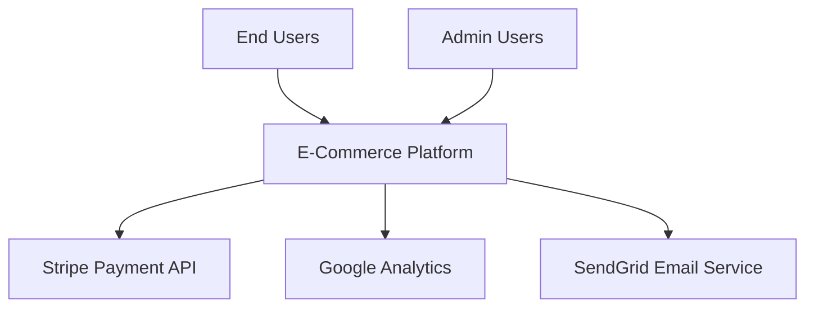
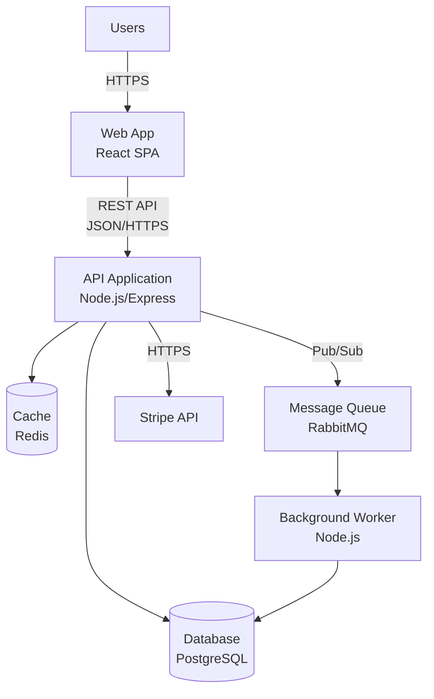
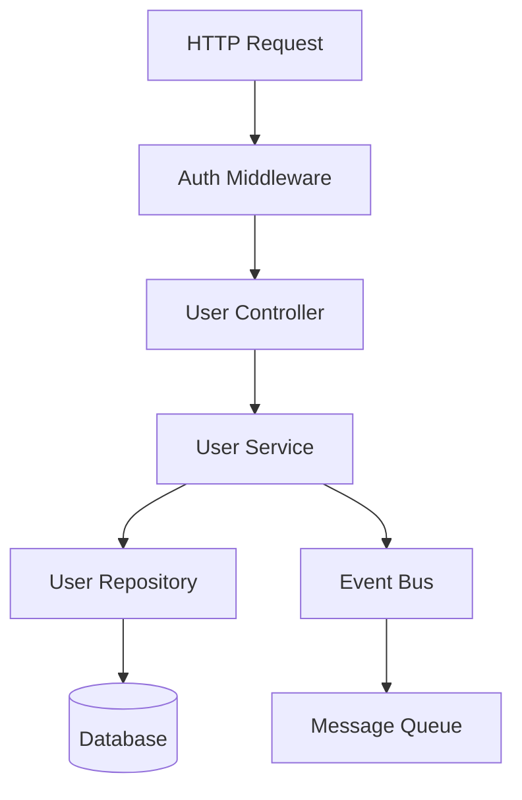
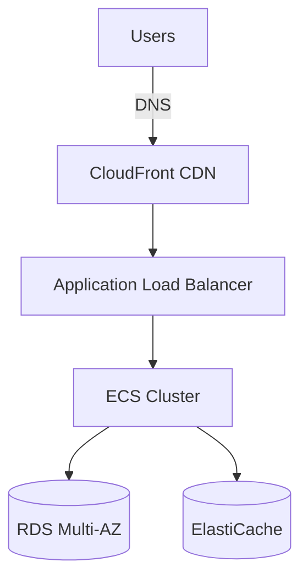
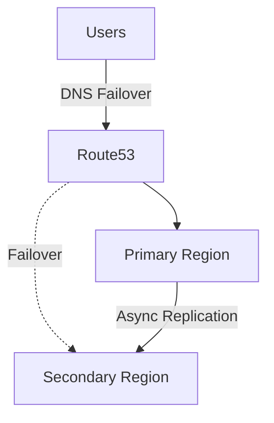
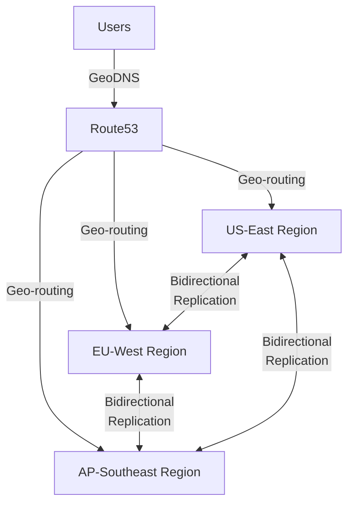

# Architecture Design Reference

## C4 Model Detailed Guide

### Level 1: System Context Diagram

**Purpose**: Show how your system fits into the wider world

**Elements**:
- **System**: The software system you're building (single box)
- **People**: User types who interact with the system
- **External Systems**: Other systems your system interacts with

**Mermaid Example**:


**When to Create**: Always - this is the starting point for all architecture

**Questions to Answer**:
- Who uses the system?
- What are their goals?
- What external systems does your system depend on?
- What data flows between systems?

### Level 2: Container Diagram

**Purpose**: Show the high-level technical building blocks

**Elements** (Containers are separately deployable/runnable units):
- Web Applications (React SPA, Angular app)
- Server Applications (Node.js API, Spring Boot API)
- Databases (PostgreSQL, MongoDB, Redis)
- Message Brokers (RabbitMQ, Kafka)
- File Storage (S3, Azure Blob)

**Mermaid Example**:


**When to Create**: Always - essential for understanding technology choices

**Technology Stack Decisions**:
- Frontend: React, Vue, Angular, Svelte
- Backend: Node.js, Python, Java, Go, .NET
- Database: PostgreSQL, MySQL, MongoDB, Cassandra
- Cache: Redis, Memcached
- Message Queue: RabbitMQ, Kafka, AWS SQS

### Level 3: Component Diagram

**Purpose**: Decompose containers into logical components

**Elements** (Components are groupings of related functionality):
- Controllers/Handlers (HTTP request handling)
- Services (business logic)
- Repositories (data access)
- Event Publishers/Consumers
- Middleware/Interceptors

**Mermaid Example**:


**When to Create**: For critical or complex containers only

**Component Patterns**:
- Layered: Controller → Service → Repository
- Event-Driven: Producer → Event Bus → Consumer
- Pipeline: Handler → Validator → Processor → Formatter

### Level 4: Code Diagram

**Purpose**: Show how components are implemented in code

**Elements**:
- Classes, interfaces, functions
- Design patterns used
- Directory structure

**When to Create**: Rarely - usually too detailed for architecture docs

**Better Alternatives**:
- Document directory structure in text
- Reference coding standards document
- Link to API documentation

## ADR (Architecture Decision Record) Guidelines

### When to Create an ADR

Create an ADR for decisions that:
- **Structural Impact**: Affect overall system structure
- **Significant Cost**: Expensive to change later
- **Quality Attributes**: Impact performance, security, scalability
- **Technology Choices**: Framework, database, language selection
- **Integration Patterns**: How systems communicate

**Examples of ADR-worthy decisions**:
- Microservices vs Monolith
- SQL vs NoSQL database
- REST vs GraphQL vs gRPC
- Authentication approach (JWT, sessions, OAuth)
- Caching strategy
- Event-driven vs request-response
- Cloud provider choice
- Deployment strategy

**Not ADR-worthy**:
- Code style preferences (use coding standards doc)
- Minor library choices
- Temporary workarounds
- Implementation details within a component

### ADR Template Detailed

```markdown
# ADR-001: Choose Microservices Architecture

**Status**: Accepted  
**Date**: 2024-01-15  
**Deciders**: Tech Lead, CTO, Senior Engineers

## Context

Our e-commerce platform is growing rapidly. We currently have a monolithic Node.js application handling all functionality. The business plans to:
- Launch in 5 new countries in the next year
- Add 20+ new features
- Scale to 10x current traffic
- Enable independent team deployments

Current pain points:
- Deployments take 45 minutes and require full system downtime
- A bug in checkout affects user browse experience
- Database queries from one feature slow down others
- Hard to scale specific high-traffic features independently

## Decision

We will migrate from a monolithic architecture to a microservices architecture with the following services:
- User Service (authentication, profiles)
- Product Catalog Service (search, browse)
- Order Service (cart, checkout)
- Payment Service (payment processing)
- Notification Service (emails, push notifications)

Each service will have its own database (except where shared data is necessary).

## Rationale

**Team Scalability**:
- Each service can be owned by a dedicated team
- Teams can deploy independently without coordination
- Different teams can use best-fit technologies for their domain

**Technical Scalability**:
- Can scale Payment Service independently during checkout peaks
- Product Catalog can use read replicas and caching without affecting orders
- Failures isolated (checkout failure doesn't break browsing)

**Deployment Flexibility**:
- Deploy multiple times per day with zero downtime
- Roll back individual services if issues found
- Canary deployments for risky changes

**Business Alignment**:
- Services map to business capabilities
- Easier to calculate per-service costs
- Can sunset features by removing services

## Consequences

**Positive**:
- Independent deployment and scaling of services
- Technology diversity (can use different languages/frameworks)
- Failure isolation improves overall system resilience
- Clear ownership boundaries for teams
- Easier to onboard new developers (smaller codebases)

**Negative**:
- Increased operational complexity (more services to monitor)
- Network latency between services
- Data consistency challenges (distributed transactions)
- Requires robust DevOps infrastructure (container orchestration)
- Testing becomes more complex (integration tests need multiple services)
- Debugging across services is harder

**Trade-offs Accepted**:
- Accepting eventual consistency for some data flows
- Investing in observability tooling (distributed tracing, logging)
- Building API gateway for routing and authentication
- Implementing circuit breakers for resilience

## Alternatives Considered

### 1. Continue with Monolith + Optimization
**Description**: Optimize current monolith with better caching, database tuning, code refactoring

**Rejected Because**:
- Doesn't solve deployment coordination problem
- Doesn't enable independent team scaling
- Doesn't solve failure isolation issues
- Only delays the inevitable refactoring

### 2. Modular Monolith
**Description**: Refactor monolith into modules with clear boundaries, but keep in single deployment

**Rejected Because**:
- Still requires coordinated deployments
- Can't scale modules independently
- Doesn't enable different technology choices
- Harder to enforce boundaries (can still reach across modules)

**Note**: We will implement modular boundaries within services as a stepping stone

### 3. Serverless Functions (FaaS)
**Description**: Break into AWS Lambda functions or similar

**Rejected Because**:
- Cold start latency unacceptable for customer-facing features
- Vendor lock-in to specific cloud provider
- Cost model unclear at our scale
- Limited execution time problematic for some batch processes

**Note**: Will use serverless for specific async tasks (image processing, report generation)
```

## Deployment Architecture Patterns

### Single-Region Deployment

**When**: Startup phase, single-market products, cost-sensitive



**Components**:
- CDN: CloudFront, Cloudflare, Fastly
- Load Balancer: ALB, NGINX, HAProxy
- Compute: ECS, Kubernetes, VMs
- Database: RDS Multi-AZ, Aurora
- Cache: ElastiCache Redis, Memcached

### Multi-Region Active-Passive

**When**: DR requirement, compliance needs, growing international



**Replication Strategy**:
- Database: Cross-region read replicas
- Storage: S3 cross-region replication
- Cache: Separate, rebuilt on failover

### Multi-Region Active-Active

**When**: Global product, low-latency requirements, high availability



**Challenges**:
- Data consistency (eventual consistency accepted)
- Conflict resolution strategies
- Higher operational complexity
- Increased costs

## Quality Attribute Strategies

### Performance

**Targets**:
- API response time: p95 < 200ms, p99 < 500ms
- Page load time: < 2 seconds (LCP)
- Database query time: p95 < 50ms

**Strategies**:
- **Caching**: Redis for session data, query results
- **CDN**: Static assets, API responses (when appropriate)
- **Database Optimization**: Indexes, query optimization, connection pooling
- **Async Processing**: Background jobs for non-critical tasks
- **Lazy Loading**: Load data as needed, not upfront
- **Pagination**: Limit result sets, cursor-based pagination
- **Code Splitting**: Frontend bundles by route

### Scalability

**Targets**:
- Support 10,000 concurrent users
- Handle 1,000 requests/second
- Scale to 100M records in database

**Strategies**:
- **Horizontal Scaling**: Add more instances (auto-scaling)
- **Database Sharding**: Partition data by tenant, region, or hash
- **Read Replicas**: Offload read traffic from primary DB
- **Message Queues**: Decouple producers from consumers
- **Stateless Services**: Enable easy horizontal scaling
- **Database Connection Pooling**: Reuse connections efficiently

### Availability

**Targets**:
- 99.9% uptime (8.76 hours downtime/year)
- Zero-downtime deployments
- Recovery time: < 5 minutes

**Strategies**:
- **Multi-AZ Deployment**: Redundancy across availability zones
- **Load Balancing**: Distribute traffic, health checks
- **Circuit Breakers**: Fail fast, prevent cascade failures
- **Health Checks**: Liveness and readiness probes
- **Blue-Green Deployments**: Zero-downtime releases
- **Database Backups**: Automated daily backups, point-in-time recovery
- **Disaster Recovery**: Regular DR drills, runbooks

### Security

**Targets**:
- Zero customer data breaches
- Pass SOC 2 Type II audit
- PCI DSS compliance for payment data

**Strategies**:
- **Authentication**: OAuth2/OIDC, MFA for admins
- **Authorization**: RBAC, attribute-based access control
- **Encryption in Transit**: TLS 1.3 for all communications
- **Encryption at Rest**: Database encryption, S3 encryption
- **Input Validation**: Sanitize all user inputs, parameterized queries
- **Rate Limiting**: Prevent brute force, DDoS mitigation
- **Security Headers**: CSP, HSTS, X-Frame-Options
- **Secrets Management**: Vault, AWS Secrets Manager
- **Audit Logging**: All access to sensitive data logged

### Maintainability

**Targets**:
- 80% code coverage for unit tests
- Deploy to production 10+ times per day
- Onboard new developer in 1 day

**Strategies**:
- **Automated Testing**: Unit, integration, E2E tests in CI/CD
- **Observability**: Structured logging, distributed tracing, metrics
- **Documentation**: Architecture docs, API docs, runbooks
- **Code Reviews**: All changes reviewed before merge
- **Linting & Formatting**: Automated code quality checks
- **Infrastructure as Code**: Terraform, CloudFormation
- **Monitoring & Alerting**: Proactive issue detection

## Common Architecture Patterns

### Event-Driven Architecture

**When to Use**:
- Need to decouple services
- Async processing is acceptable
- Multiple services need to react to same event

**Components**:
- Event Producers (services that publish events)
- Event Bus (Kafka, RabbitMQ, AWS EventBridge)
- Event Consumers (services that subscribe to events)

**Example Events**:
- `UserRegistered`: Trigger welcome email, create profile, analytics
- `OrderPlaced`: Update inventory, charge payment, send notification
- `PaymentFailed`: Retry payment, notify user, alert operations

### API Gateway Pattern

**When to Use**:
- Multiple backend services
- Need centralized auth, rate limiting, logging
- Different clients (web, mobile, partners)

**Features**:
- Routing to backend services
- Authentication & authorization
- Rate limiting & throttling
- Request/response transformation
- Caching
- API versioning

**Technologies**: Kong, AWS API Gateway, Azure API Management, Apigee

### Database Per Service

**When to Use**:
- Microservices architecture
- Need service independence
- Different data models per service

**Challenges**:
- Data consistency across services
- Joins across databases not possible
- Data duplication

**Solutions**:
- Event-driven data synchronization
- API calls for cross-service data
- CQRS (separate read/write models)
- Saga pattern for distributed transactions

### CQRS (Command Query Responsibility Segregation)

**When to Use**:
- Read and write patterns very different
- Need to scale reads independently
- Complex reporting requirements

**Pattern**:
- Command Model: Optimized for writes (normalized)
- Query Model: Optimized for reads (denormalized)
- Event Bus: Syncs data between models

**Example**:
- Write: Save order to PostgreSQL (normalized)
- Event: OrderCreated event published
- Read: Update ElasticSearch index for order search

### Strangler Fig Pattern

**When to Use**:
- Migrating from legacy system
- Can't do big-bang rewrite
- Need to maintain business continuity

**Strategy**:
1. Route new features to new system
2. Gradually migrate existing features
3. Eventually retire legacy system

**Example**:
- API Gateway routes new endpoints to microservices
- Legacy monolith handles old endpoints
- Migrate endpoint by endpoint over time
