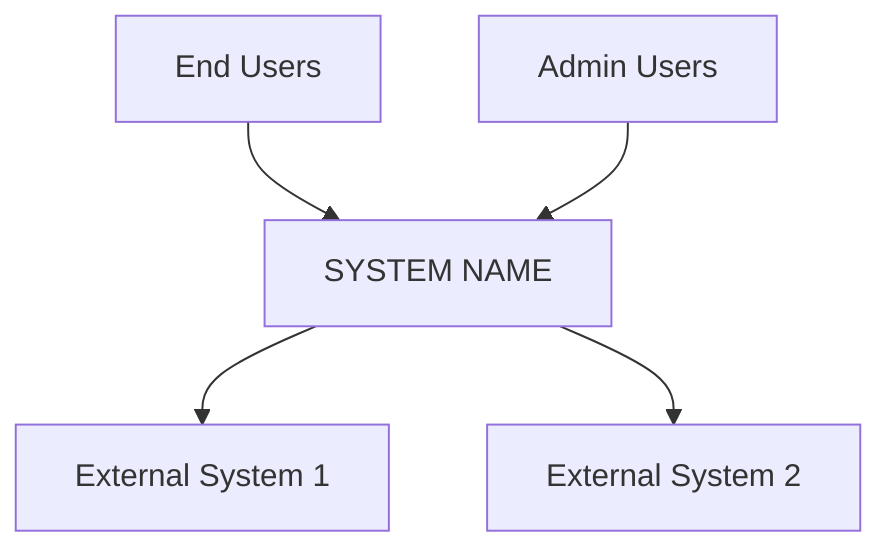
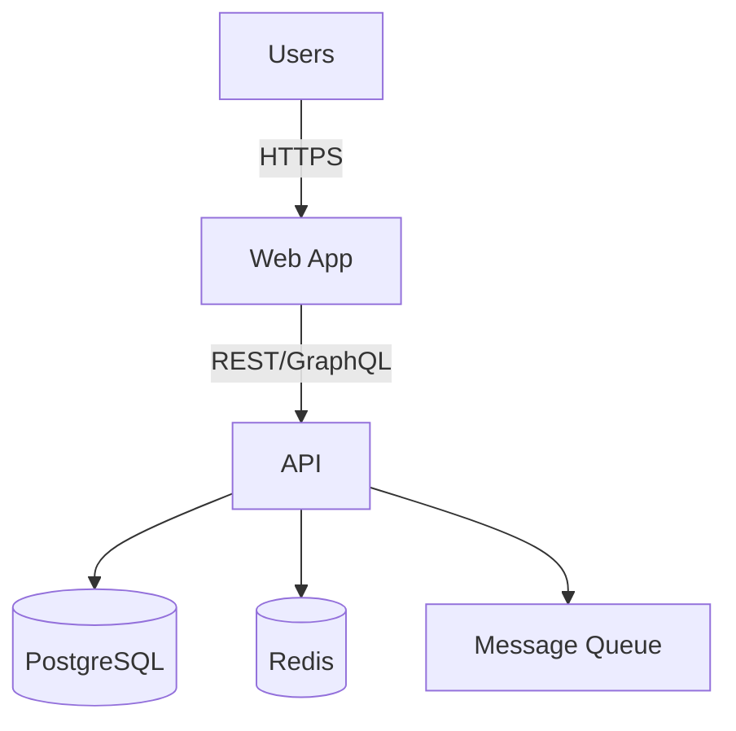
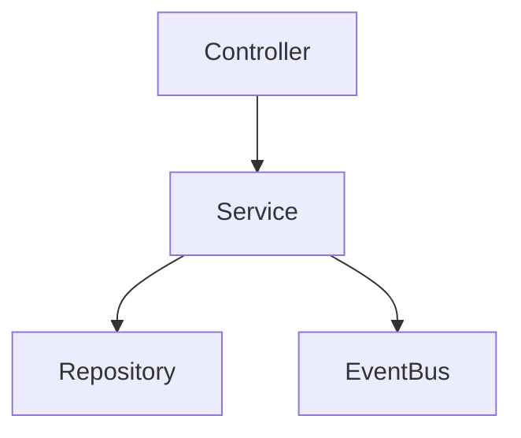

# Software Architecture Design: [PRODUCT/PROJECT NAME]

**Version**: 1.0 | **Date**: [DATE] | **Status**: Draft

**Purpose**: This template captures only the high-signal architectural data **AI agents** need to implement features correctly and safely.

---

## Table of Contents

1. Executive Summary
2. Architecture Snapshot
3. System Overview (C4)
4. Deployment Summary
5. Architecture Decisions (ADR Log)
6. Quality Attributes (Targets & Strategies)
7. Risks & Technical Debt
8. Agent Checklist

---

## 1. Executive Summary

<!-- ACTION REQUIRED: 2–3 sentences. What the system does, why it exists, and core tech choices. -->

- **What**: [Brief description]
- **Why**: [Business outcomes]
- **Core Tech**: [e.g., "API: FastAPI", "DB: PostgreSQL", "UI: React", "Infra: Kubernetes"]

---

## 2. Architecture Snapshot

<!-- ACTION REQUIRED: Keep to essentials: top goals, hard constraints, key dependencies. -->

- **Business Goals**: [Top 6 goals]
- **Constraints**: [e.g., "AWS only", "K8s 1.25+", "Existing Postgres"]
- **Quality Targets**:
  - Performance: [e.g., 95% < 200ms]
  - Availability: [e.g., 99.9% uptime]
  - Security: [e.g., OAuth2 + TLS1.3]
- **Key Dependencies**: [Stripe, SendGrid, Auth0, etc.]

---

## 3. System Overview (C4)

### 3.1 Context

<!-- ACTION REQUIRED: Prefer Mermaid; keep actors/systems tight. -->

### 3.2 Containers

<!-- ACTION REQUIRED: Prefer Mermaid; show main apps, stores, queues. -->

### 3.3 Components (Key Interfaces)

<!-- ACTION REQUIRED: Prefer Mermaid; show key modules + arrows. -->

---

## 4. Deployment Summary

<!-- ACTION REQUIRED: Minimal infra that affects runtime. -->
- **Runtime**: [e.g., Kubernetes on AWS EKS]
- **Regions/Zones**: [e.g., us-east-1, Multi-AZ]
- **Ingress**: [e.g., ALB + TLS]
- **Secrets/Config**: [e.g., AWS Secrets Manager, ConfigMaps]
- **CI/CD**: [e.g., Build, test, SAST, Docker, Helm deploy]

---

## 5. Architecture Decisions (ADR Log)

<!-- ACTION REQUIRED: 1–6 critical decisions, short. -->
| ID | Title | Status | Date |
| ---- | ------- |--------|------|
| ADR-001 | [e.g., Microservices] | Accepted | [DATE] |
| ADR-002 | [e.g., API Gateway] | Accepted | [DATE] |
| ADR-003 | [e.g., Event-Driven] | Proposed | [DATE] |

- **ADR-001 Context/Decision/Consequences**: [2–3 lines]
- **ADR-002 Context/Decision/Consequences**: [2–3 lines]

---

## 6. Quality Attributes (Targets & Strategies)

### 6.1 Performance

- Targets: [e.g., 95% < 200ms, 10k TPS]
- Strategies: caching (Redis), DB replicas + indexes, async jobs

### 6.2 Scalability

- Targets: [e.g., 100k concurrent users]
- Strategies: stateless API + HPA, sharding (by user_id), CDN

### 6.3 Availability & Reliability

- Targets: [e.g., 99.9% uptime]
- Strategies: multi-AZ, health probes, circuit breakers

### 6.4 Security

- Baseline: OAuth2 + JWT, RBAC, TLS1.3, AES-256 at rest
- Scans: SAST, DAST, dependency checks; token lifetimes

### 6.5 Maintainability & Observability

- Tests: unit/integration/E2E; >80% critical coverage
- Telemetry: structured logs, metrics (Prometheus), tracing (Jaeger)

---

## 7. Risks & Technical Debt

| ID | Risk/Debt | Impact | Mitigation/Plan |
| ---- | ----------- |--------|-----------------|
| R-001 | [e.g., DB bottleneck] | High | Replicas + caching |
| R-002 | [e.g., 3rd-party outages] | High | Circuit breakers + fallbacks |
| TD-001 | [e.g., legacy auth] | Medium | Migrate to OAuth2 |

---

## 8. Agent Checklist

<!-- ACTION REQUIRED: Fill precisely; this section anchors agent work. -->
- Inputs: [e.g., payloads, headers, auth]
- Outputs: [e.g., JSON schemas, status codes]
- Public APIs: [list endpoints with methods]
- Events: [names, payload schemas, topics]
- Data Contracts: [key tables/fields, indexes]
- SLOs: [latency, availability]
- Secrets: [sources, rotation]
- Config: [env vars, feature flags]
- Failure Modes: [timeouts, retries, idempotency]
- Security: [roles, scopes, token TTLs]

---

**Notes**

- Prefer Mermaid diagrams.
- Keep values concrete (numbers, versions, URLs).
- Link to code and schemas wherever possible.
