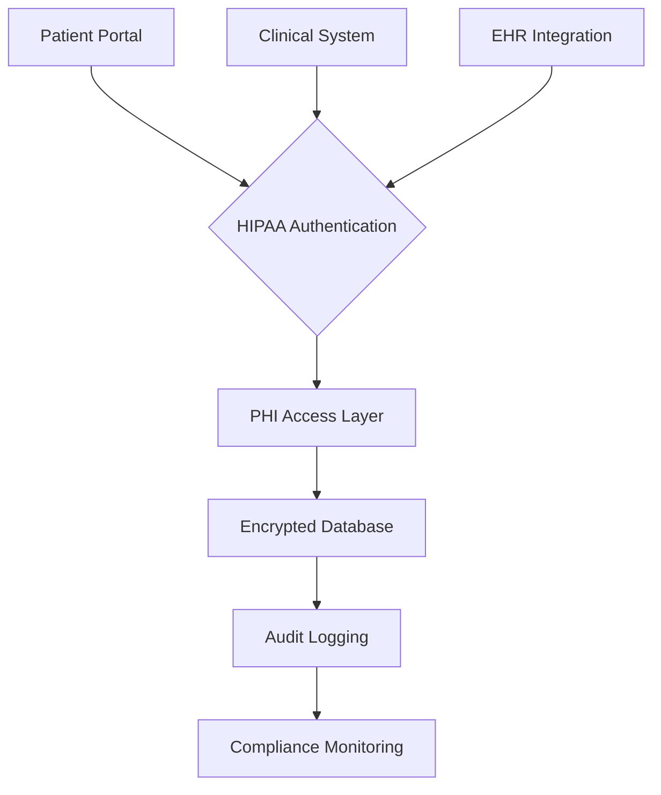
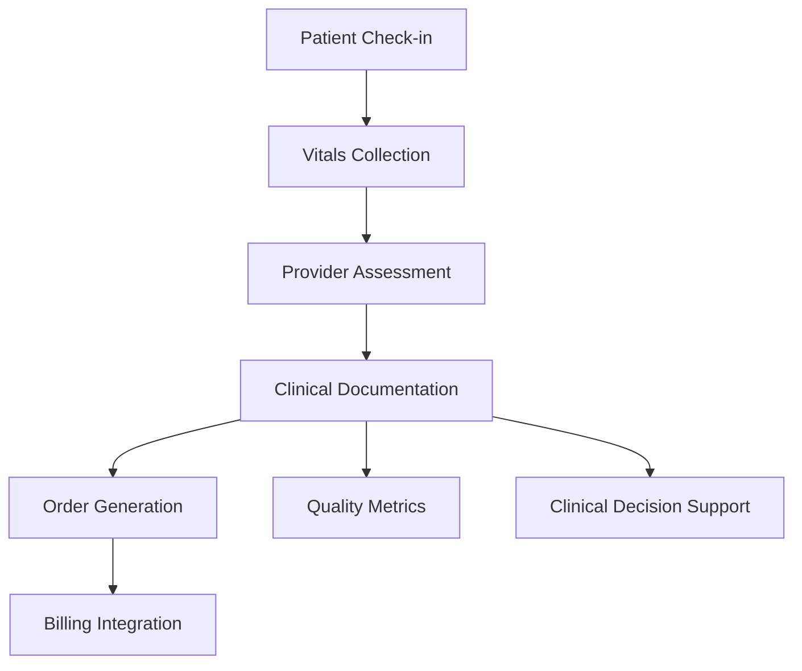

# Healthcare Data Model: [Feature Name]

**Date**: [YYYY-MM-DD]  
**Author**: [Name]  
**Related Healthcare Design**: [Link to design.md]
**PHI Classification**: [High/Medium/Low risk data model]

---

## Overview

This document defines all healthcare data entities, their PHI attributes, relationships, clinical validation rules, and HIPAA compliance requirements for the [Feature Name] implementation. All entities containing Protected Health Information (PHI) are clearly marked and include required privacy and audit controls.

---

## PHI Classification Legend

| PHI Level | Description | Access Requirements | Audit Requirements |
|-----------|-------------|-------------------|-------------------|
| 🔴 **High Risk** | Direct patient identifiers, clinical data | Role-based + MFA, patient consent | Full audit trail, breach reporting |
| 🟡 **Medium Risk** | Healthcare operations data | Role-based access | Access logging |
| 🟢 **Low Risk** | Anonymized or public data | Standard authentication | Basic logging |

---

## Healthcare Entity Summary

| Entity | Description | PHI Level | Primary Key | Type | Clinical Context |
|--------|-------------|-----------|-------------|------|------------------|
| [Patient] | [Patient demographic and clinical data] | 🔴 High | [patient_id] | Persistent | [Core patient information] |
| [Provider] | [Healthcare professional information] | 🟡 Medium | [provider_id] | Persistent | [Clinical care providers] |
| [Encounter] | [Clinical encounter documentation] | 🔴 High | [encounter_id] | Persistent | [Patient care events] |
| [MedicalRecord] | [Clinical documentation and notes] | 🔴 High | [record_id] | Persistent | [Clinical decision support] |

**Entity Types**:

- **Persistent**: Stored in HIPAA-compliant database with encryption
- **Transient**: Temporary clinical workflow data
- **External**: Managed by EHR or other healthcare systems

---

## Healthcare Entity Definitions

### Entity 1: Patient

**Description**: Core patient demographic and clinical information containing PHI. This entity requires the highest level of protection and audit controls.

**PHI Level**: 🔴 **High Risk** - Contains direct patient identifiers and clinical data

**Type**: Persistent

**Table/Collection Name**: `patients`

**Clinical Context**: Central patient record for all healthcare interactions

#### PHI Fields

| Field Name | Type | Required | PHI Level | Constraints | Description | Audit Notes |
|------------|------|----------|-----------|-------------|-------------|-------------|
| `patient_id` | UUID | Yes | 🟢 Low | Primary Key, Unique | Unique patient identifier | Access logged |
| `medical_record_number` | String | Yes | 🔴 High | Unique, Format: XXX-XX-XXXX | Hospital medical record number | Full audit trail |
| `first_name` | String | Yes | 🔴 High | Max 100 chars, No special chars | Patient first name | Masked in logs |
| `last_name` | String | Yes | 🔴 High | Max 100 chars, No special chars | Patient last name | Masked in logs |
| `date_of_birth` | Date | Yes | 🔴 High | Must be in past | Patient birth date | Age only in logs |
| `gender` | Enum | Yes | 🟡 Medium | Values: M, F, O, U | Patient gender identity | Standard logging |
| `ssn` | Encrypted String | No | 🔴 High | Format: XXX-XX-XXXX, Encrypted at rest | Social Security Number | Never logged, breach reporting |
| `address` | JSON | No | 🔴 High | Structured address format | Patient address | Masked in logs |
| `phone` | Encrypted String | No | 🟡 Medium | E.164 format, Encrypted | Contact phone number | Masked in logs |
| `email` | Encrypted String | No | 🟡 Medium | Email format, Encrypted | Contact email | Masked in logs |
| `emergency_contact` | JSON | No | 🔴 High | Structured contact format | Emergency contact info | Full audit trail |
| `insurance_info` | Encrypted JSON | No | 🟡 Medium | Structured insurance format | Health insurance details | Access logged |
| `consent_status` | Enum | Yes | 🟡 Medium | Values: CONSENTED, REVOKED, PENDING | Patient consent for data usage | Full audit trail |
| `consent_timestamp` | DateTime | No | 🟡 Medium | Required if consented | When consent was given | Audit logged |
| `created_at` | DateTime | Yes | 🟢 Low | Immutable | Record creation timestamp | Standard logging |
| `updated_at` | DateTime | Yes | 🟢 Low | Auto-update | Record last update timestamp | Standard logging |
| `updated_by` | UUID (User) | Yes | 🟢 Low | Foreign Key to users | Who last updated | Access logged |

#### PHI Field Details

**`medical_record_number`**:

- **Purpose**: Unique identifier for patient medical records
- **Format**: Hospital-specific format (e.g., "MRN-123456")
- **Clinical Importance**: Used across all healthcare systems for patient identification
- **Privacy Protection**: Never displayed in URLs or logs without masking
- **Example Values**:
  - Valid: "MRN-123456", "HOSP-789012"
  - Invalid: "123456" (missing prefix), "MRN-ABC123" (non-numeric)

**`ssn`**:

- **Purpose**: Government-issued identifier for insurance and billing
- **Clinical Context**: Required for Medicare/Medicaid and some insurance processing
- **Security Requirements**: Always encrypted at rest and in transit
- **Access Restrictions**: Only authorized billing staff with MFA
- **Audit Requirements**: All access logged with business justification
- **Breach Impact**: Immediate breach notification required

**`emergency_contact`**:

- **Purpose**: Contact information for medical emergencies
- **Clinical Safety**: Critical for patient care continuity
- **Privacy Considerations**: Contains PHI of both patient and contact person
- **Access**: Available to clinical staff during emergencies
- **Structure**:

  ```json
  {
    "name": "John Doe",
    "relationship": "Spouse",
    "phone": "+1-555-0123",
    "address": {...}
  }
  ```

#### Clinical Validation Rules

1. **PHI Data Integrity**:
   - `medical_record_number`: Must match hospital format and be unique
   - `date_of_birth`: Must be valid date and not in future
   - `ssn`: Must pass format validation if provided (but not stored in plain text)
   - `consent_status`: Must be CONSENTED for any clinical data usage

2. **Clinical Safety Validations**:
   - Emergency contact must include at least one contact method (phone or address)
   - Patient age must be calculated correctly for medication dosing
   - Gender identity must be respected in all clinical contexts

3. **HIPAA Compliance Validations**:
   - All PHI fields must be encrypted before storage
   - Access to high-risk fields requires MFA and audit logging
   - Patient consent must be verified before any data usage
   - Data retention policies must be enforced

#### Relationships

- **One-to-Many**: Patient → Encounters (one patient, many clinical encounters)
- **One-to-Many**: Patient → MedicalRecords (one patient, many clinical documents)
- **Many-to-Many**: Patient ↔ Providers (through Encounters - care relationships)
- **One-to-One**: Patient → Insurance (current primary insurance)

#### Audit Requirements

**Access Logging**:

- All read access to PHI fields logged with: user_id, timestamp, purpose, IP address
- All write access logged with: before/after values (masked for sensitive data)
- Failed access attempts logged for security monitoring

**Consent Tracking**:

- All consent status changes logged with: user_id, timestamp, reason
- Consent revocation triggers immediate access restriction

---

### Entity 2: Provider

**Description**: Healthcare professional information for clinical care delivery and accountability.

**PHI Level**: 🟡 **Medium Risk** - Professional identifiers and patient assignment data

**Type**: Persistent

**Table/Collection Name**: `providers`

**Clinical Context**: Licensed healthcare professionals providing patient care

#### Fields

| Field Name | Type | Required | PHI Level | Constraints | Description | Audit Notes |
|------------|------|----------|-----------|-------------|-------------|-------------|
| `provider_id` | UUID | Yes | 🟢 Low | Primary Key, Unique | Unique provider identifier | Access logged |
| `npi_number` | String | Yes | 🟡 Medium | Format: 10 digits, Unique | National Provider Identifier | Standard logging |
| `license_number` | String | Yes | 🟡 Medium | State-specific format | Medical license number | Standard logging |
| `first_name` | String | Yes | 🟡 Medium | Max 100 chars | Provider first name | Standard logging |
| `last_name` | String | Yes | 🟡 Medium | Max 100 chars | Provider last name | Standard logging |
| `specialty` | Enum | Yes | 🟢 Low | Values: [MD, DO, RN, PA, etc.] | Medical specialty | Standard logging |
| `department` | String | Yes | 🟢 Low | Max 100 chars | Hospital department | Standard logging |
| `contact_info` | JSON | No | 🟡 Medium | Structured contact format | Professional contact | Access logged |
| `schedule_info` | JSON | No | 🟡 Medium | Structured schedule format | Availability schedule | Access logged |
| `created_at` | DateTime | Yes | 🟢 Low | Immutable | Record creation timestamp | Standard logging |
| `updated_at` | DateTime | Yes | 🟢 Low | Auto-update | Record last update timestamp | Standard logging |

#### Clinical Validation Rules

1. **Professional Licensing**:
   - `npi_number`: Must be valid 10-digit NPI format
   - `license_number`: Must match state licensing board format
   - Specialty must be valid medical specialty designation

2. **Clinical Competency**:
   - Provider must have active license (checked against state registry)
   - Specialty must match department assignment
   - Schedule must not conflict with clinical duties

#### Relationships

- **Many-to-Many**: Provider ↔ Patients (through Encounters)
- **One-to-Many**: Provider → MedicalRecords (authored clinical notes)
- **Many-to-One**: Provider → Department (organizational assignment)

---

### Entity 3: Encounter

**Description**: Clinical encounter documentation representing patient-provider interactions.

**PHI Level**: 🔴 **High Risk** - Contains clinical care documentation and patient status

**Type**: Persistent

**Table/Collection Name**: `encounters`

**Clinical Context**: Documented healthcare interactions and clinical decision points

#### Fields

| Field Name | Type | Required | PHI Level | Constraints | Description | Audit Notes |
|------------|------|----------|-----------|-------------|-------------|-------------|
| `encounter_id` | UUID | Yes | 🟢 Low | Primary Key, Unique | Unique encounter identifier | Access logged |
| `patient_id` | UUID | Yes | 🔴 High | Foreign Key to patients | Patient involved | Full audit trail |
| `provider_id` | UUID | Yes | 🟡 Medium | Foreign Key to providers | Primary provider | Access logged |
| `encounter_type` | Enum | Yes | 🟢 Low | Values: OFFICE, HOSPITAL, TELEHEALTH, etc. | Type of encounter | Standard logging |
| `status` | Enum | Yes | 🟢 Low | Values: SCHEDULED, IN_PROGRESS, COMPLETED, CANCELLED | Encounter status | Standard logging |
| `scheduled_time` | DateTime | Yes | 🟡 Medium | Must be in future for scheduled | When encounter occurs | Access logged |
| `actual_start_time` | DateTime | No | 🟡 Medium | Set when started | When encounter began | Access logged |
| `actual_end_time` | DateTime | No | 🟡 Medium | Set when completed | When encounter ended | Access logged |
| `chief_complaint` | Text | Yes | 🔴 High | Max 2000 chars | Patient's main concern | Full audit trail |
| `vital_signs` | JSON | No | 🔴 High | Structured vitals format | Clinical measurements | Full audit trail |
| `assessment` | Text | No | 🔴 High | Max 5000 chars | Clinical assessment | Full audit trail |
| `plan` | Text | No | 🔴 High | Max 5000 chars | Treatment plan | Full audit trail |
| `created_at` | DateTime | Yes | 🟢 Low | Immutable | Record creation timestamp | Standard logging |
| `updated_at` | DateTime | Yes | 🟢 Low | Auto-update | Record last update timestamp | Standard logging |

#### Clinical Validation Rules

1. **Clinical Documentation Standards**:
   - `chief_complaint`: Must be documented for all encounters
   - Vital signs must follow clinical measurement standards
   - Assessment and plan must be completed for billable encounters

2. **Clinical Safety Validations**:
   - Encounter cannot be marked complete without assessment and plan
   - Vital signs must be within clinically reasonable ranges
   - Provider must be licensed and assigned to patient care

3. **Workflow Validations**:
   - Status transitions must follow clinical workflow (SCHEDULED → IN_PROGRESS → COMPLETED)
   - Actual times must be within scheduled time window
   - Cannot have future actual times

#### State Machine

**Encounter States**:

- **SCHEDULED**: Initial state when encounter is booked
  - → **IN_PROGRESS**: When clinical care begins
  - → **CANCELLED**: If encounter is cancelled
- **IN_PROGRESS**: Active clinical care
  - → **COMPLETED**: When clinical documentation is finished
  - → **CANCELLED**: If care is discontinued
- **COMPLETED**: Final state, clinical record complete
- **CANCELLED**: Terminal state, no further transitions

#### Relationships

- **Many-to-One**: Encounter → Patient (each encounter belongs to one patient)
- **Many-to-One**: Encounter → Provider (each encounter has primary provider)
- **One-to-Many**: Encounter → MedicalRecords (clinical documentation)
- **One-to-Many**: Encounter → Orders (diagnostic/treatment orders)

---

## Healthcare Data Flow Diagrams

### PHI Data Flow



### Clinical Workflow Data Flow



---

## Privacy & Security Controls

### Data Encryption Requirements

| Data Element | Encryption Method | Key Management | Access Controls |
|--------------|------------------|----------------|-----------------|
| SSN | AES-256-GCM | AWS KMS | MFA + Role-based |
| Medical Record Number | AES-256-GCM | AWS KMS | Role-based |
| Clinical Notes | AES-256-GCM | AWS KMS | Provider access only |
| Contact Information | AES-256-GCM | AWS KMS | Clinical staff access |

### Access Control Matrix

| User Role | Patient Demographics | Clinical Notes | Billing Info | Audit Logs |
|-----------|---------------------|----------------|--------------|------------|
| Patient | Read own | Read own | Read own | No access |
| Provider | Read/Write assigned | Read/Write assigned | Read assigned | Read own actions |
| Nurse | Read/Write assigned | Read/Write assigned | Read assigned | Read own actions |
| Admin | Read all | No access | Read/Write all | Read all |
| Billing | No access | No access | Read/Write assigned | No access |

### Audit Logging Requirements

**PHI Access Events**:

- User ID, timestamp, patient ID, data elements accessed
- Business purpose justification required
- Failed access attempts logged

**Clinical Events**:

- All clinical documentation changes
- Medication orders and changes
- Critical value notifications

**Security Events**:

- Authentication failures
- Authorization denials
- System access from unusual locations

---

## Clinical Data Validation Rules

### Patient Data Validation

1. **Demographic Consistency**:
   - Age must be consistent with date of birth
   - Address must include valid state/country
   - Emergency contact must have valid phone or address

2. **Clinical Safety Checks**:
   - Allergies must be documented before medication orders
   - Vital signs must be within clinically reasonable ranges
   - Medication contraindications must be checked

### Provider Data Validation

1. **Credential Verification**:
   - NPI must be valid and active
   - License must be current and in good standing
   - Specialty must match clinical privileges

2. **Assignment Validation**:
   - Provider must have privileges for assigned department
   - Provider schedule must allow for patient assignments

### Encounter Validation

1. **Clinical Completeness**:
   - All required SOAP note elements must be present
   - Vital signs must be documented for physical encounters
   - Assessment and plan must be clinically appropriate

2. **Workflow Compliance**:
   - Encounters must follow standard clinical workflows
   - Documentation must be completed within regulatory timeframes

---

## Data Retention and Archival

### PHI Retention Schedule

| Data Type | Retention Period | Storage Method | Disposal Method |
|-----------|------------------|----------------|-----------------|
| Clinical Records | 7 years post-discharge | Encrypted archive | Secure deletion |
| Billing Records | 7 years | Encrypted archive | Secure deletion |
| Audit Logs | 7 years | Encrypted archive | Secure deletion |
| Patient Consent | Indefinite | Encrypted database | N/A |

### Archival Procedures

1. **Automated Archival**: Data moved to long-term storage after retention period
2. **Encryption Maintenance**: Archive encryption keys securely managed
3. **Access Controls**: Archived data access requires special approval
4. **Integrity Verification**: Regular checksums to ensure data integrity

---

## Integration Points

### EHR System Integration

**Data Exchange Format**: HL7 FHIR R4

**Key Resources**:

- Patient: Demographic and clinical data
- Encounter: Clinical interactions
- Condition: Diagnoses and problems
- MedicationRequest: Prescriptions and orders

**Privacy Considerations**:

- All FHIR resources must include privacy metadata
- Consent verification required before data exchange
- Audit logging for all inter-system data transfers

### Medical Device Integration

**Standards**: IEEE 11073, HL7 FHIR Device resources

**Security Requirements**:

- Device authentication and authorization
- Encrypted data transmission
- Clinical data validation before acceptance

---

## Performance and Scalability

### Query Performance Requirements

| Query Type | Response Time | Frequency | PHI Impact |
|------------|---------------|-----------|------------|
| Patient lookup | <100ms | High | Low |
| Clinical notes retrieval | <500ms | Medium | High |
| Audit log search | <2s | Low | Medium |
| Bulk data export | <30s | Low | High |

### Indexing Strategy

**Primary Indexes**:

- Patient ID on all patient-related tables
- Provider ID on clinical tables
- Encounter ID on documentation tables

**Composite Indexes**:

- (patient_id, encounter_date) for clinical history
- (provider_id, status) for workload management

---

## Backup and Recovery

### Backup Strategy

**Frequency**: Daily full backups, hourly incremental

**Retention**: 30 days for incrementals, 7 years for full backups

**Encryption**: All backups encrypted with separate keys

**Testing**: Monthly backup restoration testing

### Disaster Recovery

**RTO (Recovery Time Objective)**: 4 hours for critical systems

**RPO (Recovery Point Objective)**: 1 hour data loss tolerance

**Procedures**: Documented failover to backup site

---

## Compliance Validation

### HIPAA Validation Checklist

- [ ] All PHI fields identified and classified
- [ ] Encryption implemented for high-risk data
- [ ] Access controls configured per role matrix
- [ ] Audit logging enabled for all PHI access
- [ ] Data retention policies implemented
- [ ] Breach notification procedures documented

### Clinical Safety Validation

- [ ] Data validation rules prevent clinical errors
- [ ] Clinical workflows enforce safety protocols
- [ ] Error handling provides safe failure modes
- [ ] Clinical decision support integrated

---

## Revision History

| Date | Version | Author | Changes | Compliance Impact |
|------|---------|--------|---------|-------------------|
| [Date] | 1.0 | [Name] | Initial healthcare data model | [PHI classification established] |
| [Date] | 1.1 | [Name] | [Clinical safety enhancements] | [Improved patient safety validations] |
